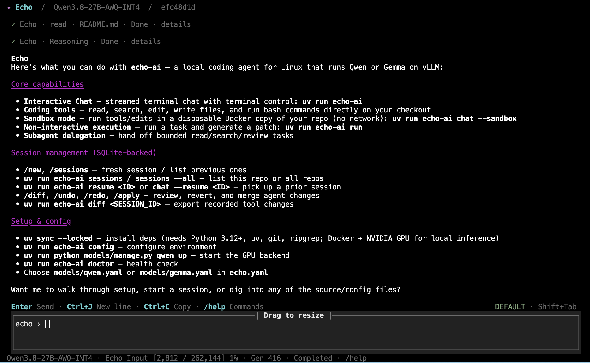

# Echo

A small local coding agent for Linux. Qwen or Gemma runs on vLLM, with the LiteLLM SDK inside Echo; coding tools edit your checkout directly by default. Use `--sandbox` to work in a disposable Docker copy instead.



## Features

- **Interactive Chat**: Streamed terminal chat with terminal control.
- **Coding Tools**: Read, search, edit, write, and execute bash commands.
- **Session Management**: Persistent SQLite-backed sessions with the ability to resume.
- **Non-interactive Execution**: Run tasks and generate patches automatically.
- **Subagent Delegation**: Delegate bounded read, search, or review tasks.

## Quick start

Requires Linux, Python 3.12+, [uv](https://docs.astral.sh/uv/), Git, Bash, and ripgrep.

```bash
git clone https://github.com/KaiMJ/echo-ai.git
cd echo-ai
uv tool install --from . echo-ai
echo-ai setup --edit
```

Configure an existing server, or follow the [local deployment instructions](docs/guides/local-models.md).
Then open your project:

```bash
cd /path/to/your-project
echo-ai status
echo-ai
```

Settings live in `~/.config/echo-ai/` (or `$XDG_CONFIG_HOME/echo-ai/`).
See [Getting started](docs/guides/getting-started.md) for the first-run guide and
[Configuration](docs/guides/configuration.md) for credentials, repairs, and local development.

## Documentation

- [User guides](docs/guides/README.md): setup and available workflows.
- [Google tools setup](docs/guides/google-tools.md): notes for a private development example. Google agent tools are still planned.
- [Development documentation](docs/development/README.md): current architecture, implementation plans, and experiments.
- [Security essentials](docs/guides/security.md): execution risks, data privacy, and approvals.

## Security

Echo runs commands with your permissions by default. Review actions before approving them; `--sandbox` reduces risk but does not guarantee isolation from malicious code. See [Security essentials](docs/guides/security.md).

Report vulnerabilities privately through **Security → Report a vulnerability** on [GitHub](https://github.com/KaiMJ/echo-ai/security), if available. Otherwise, open an issue asking for a private contact without sharing exploit details, credentials, or private data.
